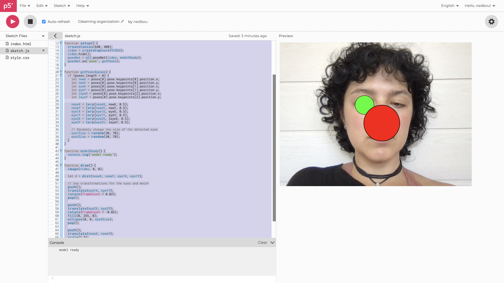
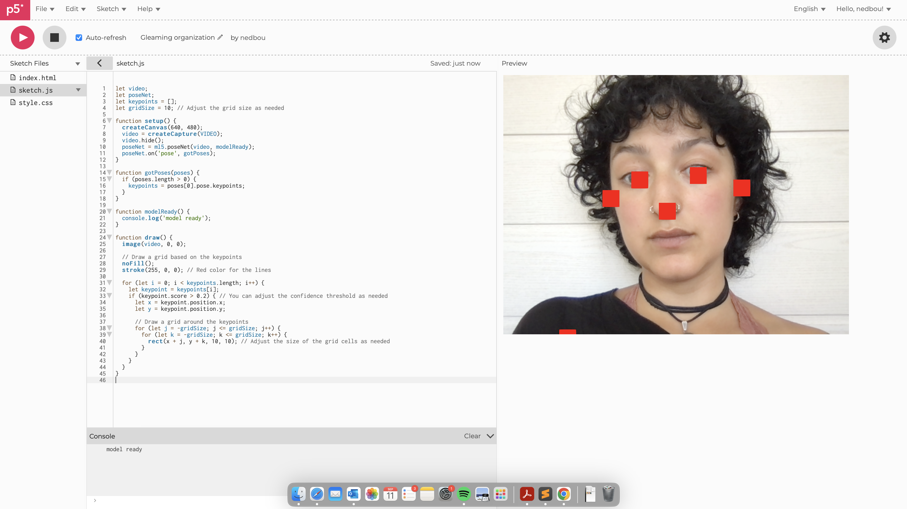
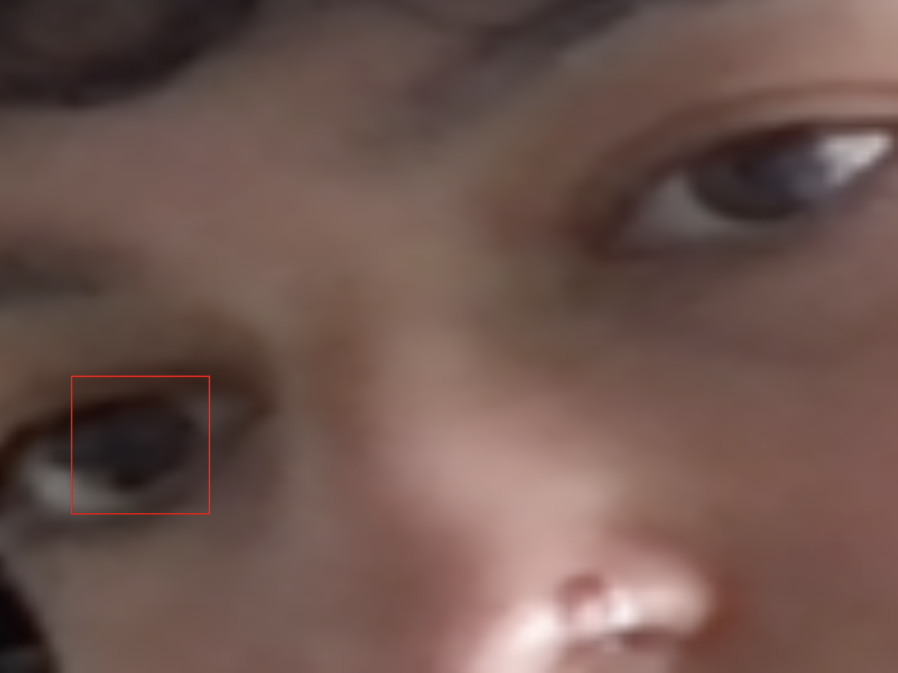

# Day 06

## Face Generator

I first started with the "the coding train" tutorial
https://www.youtube.com/results?search_query=the+coding+train+face++camera

From there I achieved to only make rectangles on my eyes

<iframe src="content/day06/01/embed.html" width="100%" height="450" frameborder="no"></iframe>


and then to this. Wasn't my plan. I wanted to make only the eyes move around and get bigger and smaller


<iframe src="content/day06/02/embed.html" width="100%" height="450" frameborder="no"></iframe>
